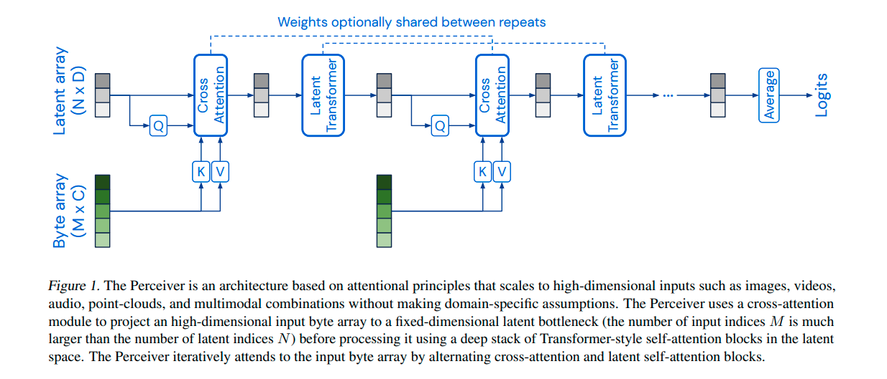
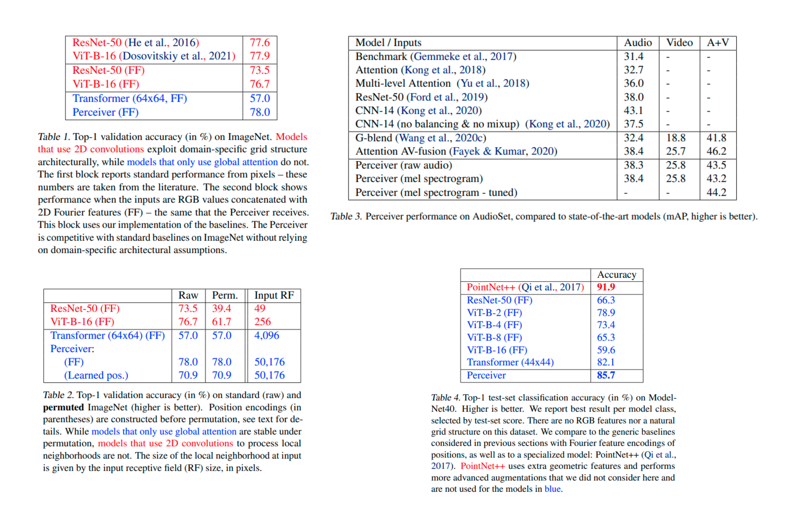

## [Perceiver: General Perception with Iterative Attention](https://arxiv.org/abs/2103.03206)
## Quick Look

**Authors**: Andrew Jaegle, Felix Gimeno, Andrew Brock, Andrew Zisserman, Oriol Vinyals, Joao Carreira

**Date Published** : 4 March 2021 

**Published at:**  Proceedings of the 38th International Conference on Machine Learning, PMLR 139, 2021. 

**TLDR:** A modality independent transformer that utilizes cross attention mechanism to learn fixed-size representations from arbitrarily high dimensional inputs without making strong architectural assumptions about the relationship between the inputs.

**Tags**: AI, CV, ML

---

## Paper summary:
Introduce the Perceiver, a model that builds upon Transformers and hence makes few architectural assumptions about the relationship between its inputs, but that also scales to hundreds of thousands of inputs, like ConvNets. The model leverages an asymmetric attention mechanism to iteratively distill inputs into a tight latent bottleneck, allowing it to scale to handle very large inputs with being locked a certain modalities.

## Issues addressed by the paper:
- Able to handle arbitrary configurations of different modalities using a single Transformer-based architecture.
- Uses Cross-Attentional Bottleneck that can handle high-dimensional inputs while retaining the expressivity and flexibility needed to deal with arbitrary input configurations.
- Eliminates the quadratic scaling problem of all-to-all attention of a classical Transformer and decouples the network depth from the input’s size, allowing us to construct very deep models.

## Methodology:

The architecture is comprised of two components:
- A cross-attention module that maps a byte array (e.g. an pixel array) and  a latent array to a latent array
- A Transformer tower that maps a latent array to a latent array.

Inner Workings(for ImageNet):

- Images at resolution 224 = 50,176 pixels are mapped down to a latent array of 512. The model applies the cross-attention module and the Transformer in alternation which projects the higher-dimensional byte array through a lower-dimension attention bottleneck before processing it with a deep Transformer, and then using the resulting representation to query the input again.
- The model can also be seen as performing a fully end-to-end clustering of the inputs with latent positions as cluster centres, leveraging a highly asymmetric cross-attention layer.
- The model optionally share weights between each instance of the
Transformer tower (and between all instances of the cross-attention module but the first), our model can be interpreted
as a recurrent neural network (RNN), but unrolled in depth
using the same input, rather than in time.
- All attention modules in the Perceiver are non-causal and do not use no masks.

- Taming quadratic complexity with cross-attention: The model apply attention directly to the inputs by introducing an asymmetry into the attention operation. To see how this works, first note that for Q ∈ R^M×D, K ∈ R^M×C , and V ∈ R^M×C , (where C and D are channel dimensions) the complexity of the QKV  attention operation – essentially, softmax(QK^T)V – is O(M^2), as it involves two matrix multiplications with matrices of large dimension M. By introducing asymmetry: while K and V are projections of the input byte array, Q is a projection of a learned latent array with index dimension N << M, where the latent’s index dimension N is a hyperparameter. The resulting cross-attention operation has complexity O(MN)

- Uncoupling depth with a latent Transformer: The output of the bottleneck cross-attention module transform the shape of the input the shape of the latent array . Therefore, each of the following layers costs of O(N2) and for L layers, the complexity is O(LN^2) instead of O(LM^2).

- Iterative cross-attention: The severity of the bottleneck may restrict the network’s ability to capture all of the necessary details from the input signal. To counter this, the Perceiver may be structured with multiple cross-attend layers, which allow the latent array to iteratively extract information from the input image as it is needed. This allows us to tune the model to balance expensive, but informative cross-attends against cheaper, but potentially redundant latent self-attends. Although more cross-attends leads to better performance, but increases the computational requirements of the model because it increases the number of layers with linear dependence on the input size.

- Weight Sharing: Finally, the iterative structure architecture allows the model to be parameter efficient by sharing weights between the corresponding blocks of each latent Transformer and/or between cross-attend modules. Latent self-attention blocks can still be shared if only a single cross-attend is used. The ImageNet experiment  10x reduction in the number of parameters, while reducing over-fitting and boosting validation performance.

- Achieving Permutation Invariance: Using Fourier feature position encodings which allows:
    - Directly represent the position structure of the input data (preserving 1D temporal or 2D spatial structure for audio or images, respectively, or 3D spatiotemporal structure for videos)
    - Control the number of frequency bands in our position encoding independently of the cutoff frequency, and
    - Uniformly sample all frequencies up to a target resolution.

The resulting architecture has the functional form of an RNN with a cross-attention
input projection, a bottle-necked latent dimensionality, and a latent Transformer recurrent core.

### Results:

### Limitations:
- Using positional information while claiming to be modality/input independent?

## Conclusions and Future Work:
- Perceiver opens new avenues for general perception architectures that make few assumptions about their inputs and that can handle arbitrary sensor configurations, while enabling fusion of information at all levels.

- With great flexibility comes great over-fitting, and many of our design decisions were made to mitigate this.

- Despite reducing modality-specific knowledge, the model still uses specific augmentation and position encoding, with potential for further research in end-to-end modality-agnostic learning.

## Possible  / Improvements Ideas:

---

## Useful Links:
- https://www.youtube.com/watch?v=P_xeshTnPZg&pp=ygUQcGVyY2VpY3ZlciBwYXBlcg
- https://www.youtube.com/watch?v=WJWBq4NZfvY&pp=ygUQcGVyY2VpY3ZlciBwYXBlcg
- https://www.youtube.com/watch?v=wTZ3o36lXoQ&pp=ygUQcGVyY2VpY3ZlciBwYXBlcg
- https://www.youtube.com/watch?v=Xe7VT8-kDzg&pp=ygUQcGVyY2VpY3ZlciBwYXBlcg

